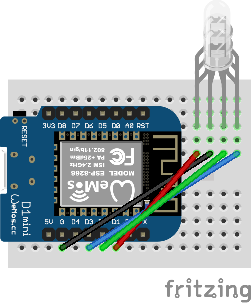
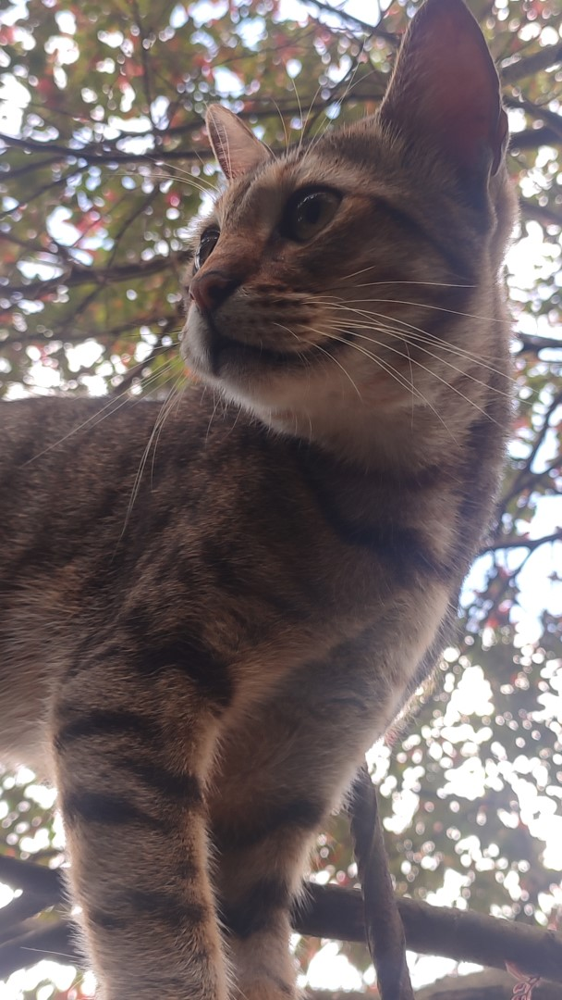

# VmixToESPTally

A simple firmware for ESP8266 Boards to make a portable Tally Light System!

### What are Tally Lights?

Tally Lights are used in the broadcasting world to let Camera Operators know when their feed is currently on Program or Preview, giving them a heads up on when they're On Air, or about to be (On Preview).

### How does this Project work?

This project is meant to be flashed to an ESP8266 Board, with one board being used for each instance where a tally light is needed. (Multiple lights from One Board Coming Soon?)

The Board is assigned to an input number, connects to WiFi, and opens a persistent TCP connection to the vMix API (Port 8099). It subscribes to tally updates, meaning vMix pushes changes to the light without constant polling. It then sets the color and animation state of the LEDs connected to GPIO Pins.

## Features

- Web UI Configuration: No need to reflash! Set WiFi, vMix IP, and Input Number straight from your phone or browser.
- Low-Latency Push API: Uses the vMix TCP API instead of HTTP polling for instant feedback.
- Fallback Access Point Mode: If the board can't find a known WiFi network, it creates its own "Tally-Setup" network so you can configure it on the fly.
- mDNS Support: Access the config page easily via a friendly URL (e.g., [http://tally.local](http://tally.local)).
- Animated LED States:
    - Boot Stage: Fading Yellow
    - Connected to WiFi, no vMix: Blinking Yellow
    - Ready: Solid Blue
    - Preview: Solid Yellow
    - Program: Solid Red
    - AP Mode (First Setup or no known Network): Blinking Blue
- Allows assignment of the Board to a static IP or DHCP directly via the Web UI.
- View Tally Status using a 4 Pin RGB LED (Neopixel Version Coming Soon!)
  

## Config

Unlike older versions, you do not need to edit code to change networks or vMix IPs. The config.h file in src is now only used to set hardware constants:

- Pins used for LEDs (Wiring Diagram for Default Config is given below)
- Fallback AP credentials
- EEPROM memory maps
  
### Should I use an Input Number or it's GUID. Also, what's a GUID

A GUID is a unique identifier for an input in Vmix. Rearranging inputs will not affect the GUID. Therefore, it's a reliable way to ensure that you always point to the correct Input.

Unfortunately due to the migration to TCP API (which returns tally state as a string of inputs), the firmware now takes input numbers. A future update may bring GUID -> Input Number conversion allowing for the tally to persist through input rearrangements.

## Installation using PlatformIO in Visual Studio Code

- Clone the repo on your Machine with;
```bash
git  clone  https://github.com/Dilagante/vmix2ESPTally
```
- Connect your ESP8266 Board over USB
- In the PlatformIO Tab of VSCode, open the folder containing the platformio.ini file
- Check config.h to make sure the LED pins match your wiring.
- Upload to your Board!

## Setup Workflow

- Power on the board. If it can't find a saved network, the LED will blink blue and broadcast a WiFi network called Tally-Setup.
- Connect to this network with your phone or laptop.
- Navigate to the Web UI ([http://192.168.4.1](http://192.168.4.1)).
- Enter your studio's WiFi credentials, the vMix Machine IP, your desired Input Number, and optional Static IP settings.
- Click Save & Reboot! The light will connect to your studio network and begin listening for cuts.
- Once connected, you can update settings anytime by navigating to [http://tally.local](http://tally.local) (or whatever mDNS name you assigned).

  
## Default Wiring Diagram



## What's next?

- ESP32 Support (May work, currently untested)
- Separate version with Neopixel support (A single data pin to control an LED Strip like WS2812)
- Control multiple light strips from one board (Unpractical unless Cameras/Feeds are right next to each other but let's see)

  

## Libraries Used

- [ESP8266WiFi.h](https://github.com/esp8266/Arduino/blob/master/libraries/ESP8266WiFi/)
- [ESP8266WebServer.h](https://github.com/esp8266/Arduino/tree/master/libraries/ESP8266WebServer/)
- [ESP8266mDNS.h](https://github.com/esp8266/Arduino/tree/master/libraries/ESP8266mDNS/)
- [EEPROM.h](https://github.com/esp8266/Arduino/tree/master/libraries/EEPROM/)
- [ESP8266WebServer.h](https://github.com/esp8266/Arduino/tree/master/libraries/ESP8266WebServer/)

## License

[MIT License](https://choosealicense.com/licenses/mit/)

Copyright© [2026]

Permission is hereby granted, free of charge, to any person obtaining a copy of this software and associated documentation files (the "Software"), to deal in the Software without restriction, including without limitation the rights to use, copy, modify, merge, publish, distribute, sublicense, and/or sell copies of the Software, and to permit persons to whom the Software is furnished to do so, subject to the following conditions:

The above copyright notice and this permission notice shall be included in all copies or substantial portions of the Software.

THE SOFTWARE IS PROVIDED "AS IS", WITHOUT WARRANTY OF ANY KIND, EXPRESS OR IMPLIED, INCLUDING BUT NOT LIMITED TO THE WARRANTIES OF MERCHANTABILITY, FITNESS FOR A PARTICULAR PURPOSE AND NONINFRINGEMENT. IN NO EVENT SHALL THE AUTHORS OR COPYRIGHT HOLDERS BE LIABLE FOR ANY CLAIM, DAMAGES OR OTHER LIABILITY, WHETHER IN AN ACTION OF CONTRACT, TORT OR OTHERWISE, ARISING FROM, OUT OF OR IN CONNECTION WITH THE SOFTWARE OR THE USE OR OTHER DEALINGS IN THE SOFTWARE.


Also this is my cat

